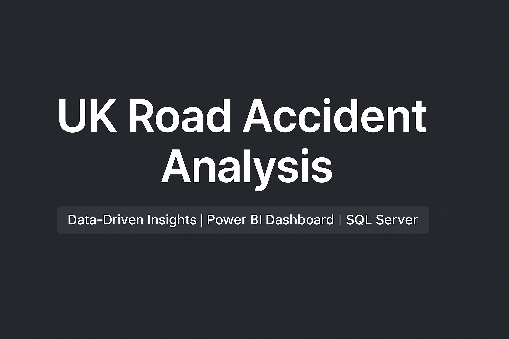

# 🚦 UK Road Accident Analysis Project

 

This project analyzes UK road traffic accident data using Microsoft SQL Server and Power BI to uncover patterns, trends, and actionable insights to improve road safety.

---

## 📊 Project Overview
Road accidents have a significant impact on public health, transportation efficiency, and the economy.  
This project explores:
- Accident trends over time
- Casualty severity levels
- Vehicle types involved
- Light conditions, road types, and location densities
- Urban vs Rural accident distributions

---

## 🎯 Objectives
- Analyze accident patterns using real-world data.
- Create an interactive Power BI dashboard.
- Derive actionable insights and propose recommendations.
- Showcase data storytelling and business intelligence skills.

---

## 🛠️ Tools and Technologies
- **Microsoft SQL Server** — Data cleaning, querying, and analysis
- **Power BI** — Data visualization and dashboard creation
- **Excel** — Initial data exploration and preprocessing
- **GitHub** — Project hosting and documentation

---

## 🗂️ Project Structure
accident-analysis-dashboard/ ├── README.md ├── Insights_Report.md ├── dashboard/ │ └── Accident_Analysis.pbix ├── screenshots/ │ └── dashboard_preview.png └── data/ └── (Optional) cleaned_data.csv

## 🌐 Live Dashboard Access
Experience the interactive dashboard live here:

👉 [**Click to View the Live Dashboard**](https://app.powerbi.com/view?r=eyJrIjoiMTBkMWM5ODktMmIyOC00YmEwLWExMzctNmYxY2IzNTNjZjIzIiwidCI6ImRmODY3OWNkLWE4MGUtNDVkOC05OWFjLWM4M2VkN2ZmOTVhMCJ9)

> *Explore accident trends, casualty severity, vehicle types, and more — directly from your browser!*

---

## 📸 Dashboard Preview

---

## ❓ Key Business Questions Answered
- How many accidents and casualties occurred?
- Which vehicle types are most involved in accidents?
- When do accidents peak during the year?
- How do accidents differ between light conditions and road types?
- Are urban or rural areas more accident-prone?
- What recommendations can be made to reduce accidents?

---

## 🔍 Key Insights
- Accidents decreased by 11.7% compared to the previous year.
- 74% of accidents occur during daylight hours.
- Cars are the most common vehicle involved in accidents.
- Single carriageways contribute the most to accident casualties.
- Urban areas experience a higher number of accidents than rural areas.

---

## 📄 Detailed Report
For a deeper analysis, findings, and recommendations, please read the full [Insights Report](./Insights_Report.md).

---

## 💡 Recommendations
- Launch safety awareness campaigns during October–December.
- Improve single carriageway road safety measures.
- Promote defensive driving programs, even during the day.
- Implement stricter urban traffic controls.
- Develop better bike lanes and promote bike safety.

---

## 🚀 How to Use This Project
1. Open the `.pbix` file with Power BI Desktop.
2. Explore interactive visualizations and filters.

---

## 📢 Conclusion
This project highlights how data analytics and visualization can uncover important patterns and drive impactful policy decisions to enhance road safety.

---

## 👨‍💻 Author
- **Ridwan** — Data Analyst | BI Developer | Data Enthusiast

Feel free to connect or collaborate!

---
